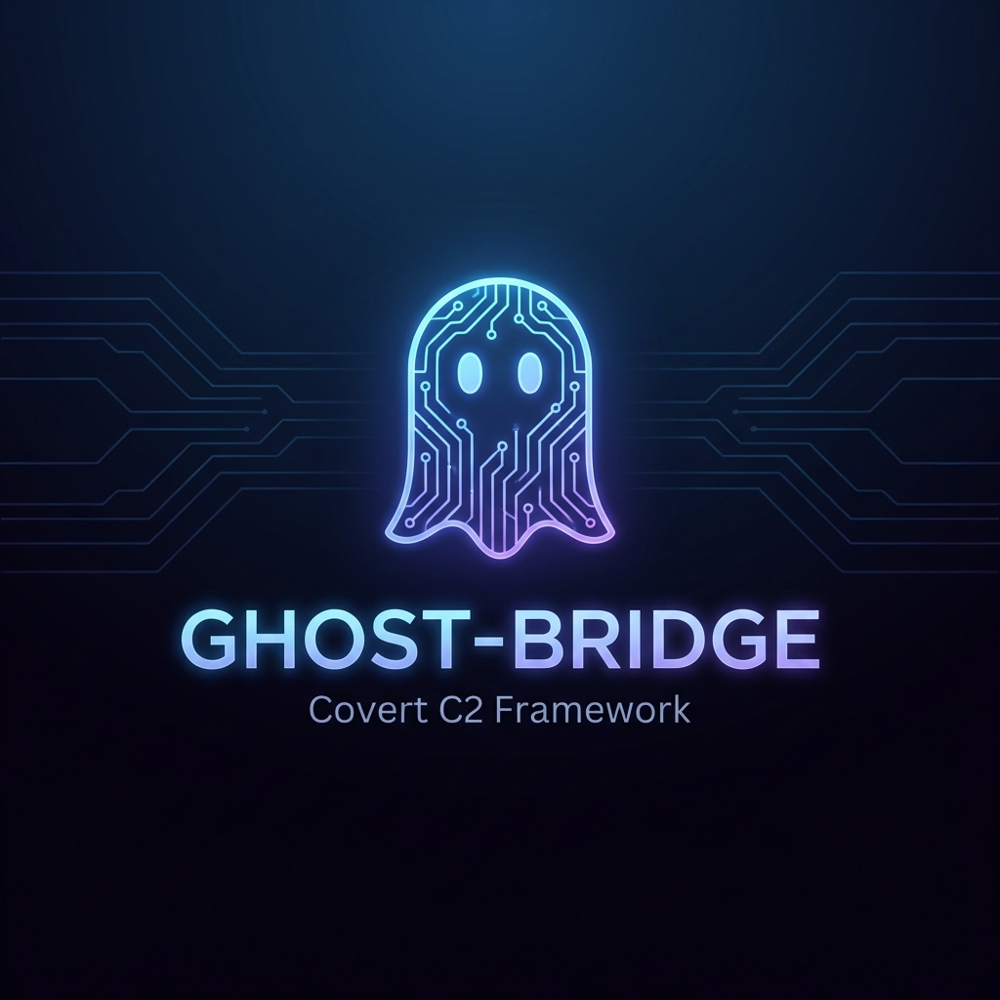
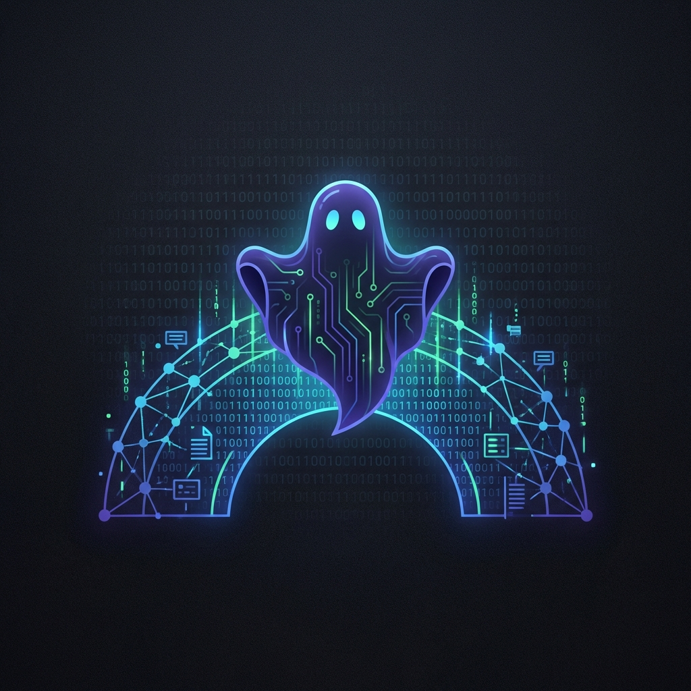

<p align="center">
  
</p>

<p align="center">
  <b>Infraestrutura C2 Encoberta via APIs Legítimas</b>
</p>

<p align="center">
  
  
  
  
</p>

---

## 🎯 Sobre

**Ghost-Bridge** é um framework de Comando e Controle (C2) projetado para ser **invisível** a ferramentas de monitoramento de rede. Em vez de conectar a servidores suspeitos, toda comunicação passa por **APIs legítimas e confiáveis**:

- 📨 **Discord** → Downlink (receber comandos)
- 📊 **Google Sheets** → Uplink (exfiltrar dados)

> O tráfego aparece como uso normal de apps corporativos, contornando Firewalls, IDS/IPS e EDR.

---

## ✨ Features

### 🛠️ Toolkit Completo (9 Módulos)

| Módulo | Descrição |
|--------|-----------|
| 🔤 **Keylogger** | Captura teclas com contexto de janela |
| 📸 **Screenshot** | Captura de tela multi-monitor |
| 📋 **Clipboard** | Monitor de área de transferência |
| 🌐 **Browser** | Extração de senhas, cookies, cartões |
| 🖥️ **System Info** | Reconhecimento completo do sistema |
| 📁 **File Exfil** | Busca e exfiltração de arquivos |
| 📹 **Webcam** | Captura silenciosa de câmera |
| 🎤 **Audio** | Gravação de microfone |
| 🔒 **Persistence** | Múltiplos métodos de persistência |

### 🔐 Segurança

- **Criptografia AES-256** em todo tráfego
- **Jitter aleatório** para evitar detecção de padrões
- **Separação de canais** (comando ≠ exfiltração)

---

## 🚀 Quick Start

### 1. Instalação

```bash
# Clone o repositório
git clone https://github.com/seu-usuario/ghost-bridge.git
cd ghost-bridge

# Instale dependências
pip install -r requirements.txt

# Ou use o instalador
./install.bat
```

### 2. Configuração

```bash
# Copie o template
cp .env.example .env

# Edite com suas credenciais
# OPERATION_MODE=REAL
# DISCORD_BOT_TOKEN=...
# DISCORD_CHANNEL_ID=...
```

### 3. Teste (Modo Mock)

```bash
# Demo interativa
python demo.py

# Teste comando específico
python agent.py --test "!help"
```

### 4. Produção

```bash
# Compile para .exe
python build.py

# Deploy
# Copie GhostUpdater.exe + secret.key para o alvo
```

---

## 📖 Comandos

```
BÁSICO
  !help              Lista comandos
  !info              Info do agente
  !recon             Reconhecimento completo

CAPTURA
  !screenshot        Captura tela
  !webcam            Foto da webcam
  !audio <seg>       Grava áudio

MONITORAMENTO
  !keylog start/stop Keylogger
  !clipboard start   Monitor clipboard

BROWSER
  !browser all       Extrai tudo
  !browser passwords Apenas senhas

ARQUIVOS
  !files search      Busca sensíveis
  !files exfil docs  Exfiltra documentos

PERSISTÊNCIA
  !persist install   Instala persistência
```

---

## 🏗️ Arquitetura

```
┌─────────────┐     Discord API      ┌─────────────┐
│ Controlador │ ──────────────────▶ │   Discord   │
│   (CLI)     │   (Comandos)         │   Channel   │
└─────────────┘                      └──────┬──────┘
                                            │
                                            ▼ (Polling)
                                     ┌─────────────┐
                                     │   Agente    │
                                     │  (Implant)  │
                                     └──────┬──────┘
                                            │
                                            ▼ (Exfiltração)
┌─────────────┐   Google Sheets API  ┌─────────────┐
│ Controlador │ ◀────────────────── │   Google    │
│   (CLI)     │                      │   Sheets    │
└─────────────┘                      └─────────────┘
```

---

## 📁 Estrutura

```
ghost-bridge/
├── agent.py          # Implant principal
├── controller.py     # Interface do operador
├── connectors.py     # Discord + Google Sheets
├── config.py         # Configuração (.env)
├── crypto_utils.py   # AES-256
├── demo.py           # Demonstração
├── build.py          # Compilação .exe
├── modules/
│   ├── keylogger.py
│   ├── screenshot.py
│   ├── clipboard.py
│   ├── browser.py
│   ├── system_info.py
│   ├── file_exfil.py
│   ├── webcam.py
│   ├── audio.py
│   └── persistence.py
└── docs/
```

---

## ⚠️ Aviso Legal

Esta ferramenta é destinada **exclusivamente** para:
- 🔴 **Red Team** autorizado
- 🔬 **Pesquisa de Segurança**
- 📚 **Fins educacionais**

O uso não autorizado contra sistemas de terceiros é **ilegal**. Os autores não se responsabilizam pelo uso indevido.

---

## 📜 Licença

Este projeto é fornecido apenas para fins educacionais e de pesquisa em segurança.

---

<p align="center">
  
  <br>
  <i>Ghost-Bridge v2.0 - Covert C2 Framework</i>
</p>
